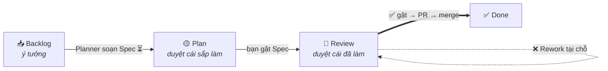
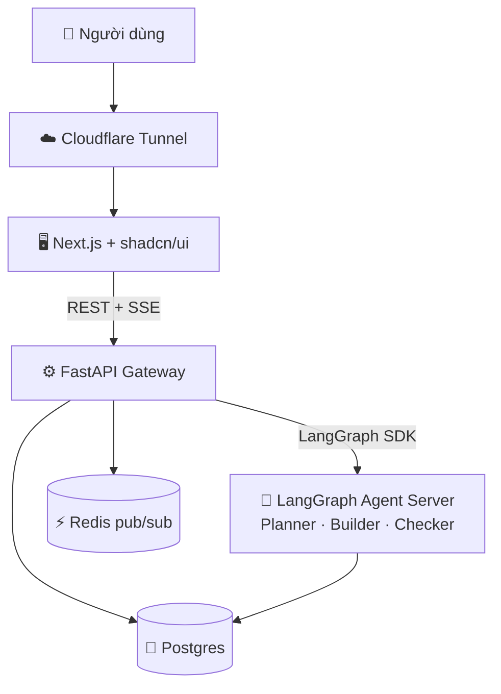

<picture>
  <source media="(prefers-color-scheme: dark)" srcset="web/public/brand/specdeck-horizontal.svg" />
  
</picture>

### Control deck để điều phối nhiều coding agent bất đồng bộ

**Bạn duyệt ở tầng _Spec & Checklist_ — không phải đọc từng dòng diff.**

-0ea5e9)

---

> [!NOTE]
> **AI agent biến coding từ đồng bộ → bất đồng bộ.** Khi nhiều agent chạy song song, nút thắt dời từ *viết code* sang **review**. SpecDeck cho con người ngồi ở tầng *quyết định* — duyệt **Spec** và **Evidence**, không phải tầng diff.

## 🧩 Vấn đề

Một agent chạy 2–5 phút mỗi Task; chạy nhiều agent song song thì bottleneck là **planning + review**, không phải gõ code.

- **Terminal agent** mạnh nhưng không có giao diện để *nhìn* — khó nắm nhiều luồng, khó cho người không rành terminal.
- **IDE agent** tốt ở cấp độ dòng nhưng bó vào "1 dev – 1 file – đồng bộ".
- **Kanban hiện có** quản được *trạng thái* nhưng không giải quyết bottleneck thật: người vẫn phải đọc 10 cái PR.

## 💡 Ý tưởng cốt lõi — Spec là hợp đồng chung

Mỗi **Task** sinh một **Spec** (mục tiêu + **Acceptance** + danh sách **Check**). Artifact này là hợp đồng dùng chung cho 4 bên — nên review chuyển từ *đọc diff (đắt)* sang *duyệt ý định (rẻ)*:

| Bên | Spec là gì với họ |
|---|---|
| 🧭 **Planner** | bản kế hoạch nó tự đề xuất |
| 🔨 **Builder** | mục tiêu + bài test phải đạt |
| 🔍 **Checker** | thước đo (rubric) để chấm ✅/❌ |
| 👤 **Con người** | thứ cần duyệt — kèm **Evidence**, không phải code |

> **Evidence là bắt buộc.** Mỗi Check ✅ phải kèm ảnh/video/test/log. Thiếu Evidence = coi như chưa pass. Đây là thứ tạo niềm tin thay cho việc đọc code.

## 🔄 Cách hoạt động — Board 4 cột

Chỉ trạng thái mà *con người bị chặn* mới thành cột. "Agent đang chạy" là **badge ⏳**, không phải cột.

| Cột | Bạn duyệt gì |
|---|---|
| **Backlog** | ý tưởng, chưa có Spec |
| **Plan** 🟡 | *cái sắp làm* — Spec + Acceptance |
| **Review** 🔴 | *cái đã làm* — Checks đã chấm + Evidence (và diff cho dev) |
| **Done** ✅ | đã merge |

## 🤖 Ba vai agent

- 🧭 **Planner** — biến ý tưởng thành **Spec** (qua side-panel hỏi–đáp). Điểm con người *nắn hướng trước khi code*.
- 🔨 **Builder** — viết code đạt Spec, trong **git worktree** cô lập; nhiều Builder chạy song song trên các Task độc lập.
- 🔍 **Checker** — **độc lập với Builder** (khác model, context riêng), chấm từng Check kèm Evidence. Fail → **Rework**.

## 🏗️ Kiến trúc

Monorepo, self-host qua **Cloudflare Tunnel**. Topology 3 tầng (kiểu DeerFlow v2): agent tách hẳn khỏi backend.

| Tầng | Công nghệ |
|---|---|
| **Frontend** | Next.js (App Router) · Tailwind · shadcn/ui |
| **Gateway** | FastAPI — REST + bridge SSE |
| **Agent** | LangGraph Server riêng — Planner/Builder/Checker |
| **Data / realtime** | Postgres + Redis pub/sub → SSE |

→ Chi tiết: [ARCHITECTURE.md](ARCHITECTURE.md) · [ADR: agent-architecture](docs/design-docs/agent-architecture.md) · [ADR: stack](docs/design-docs/stack.md)

## 📊 Trạng thái

> [!WARNING]
> **Concept → đang dựng UI.** Kiến trúc & stack đã chốt qua ADR; skeleton đã scaffold — web (Next.js+shadcn) · gateway (FastAPI) · agent (LangGraph) · docker-compose (Postgres+Redis), `docker compose up --build` chạy được. **Web frontend (mock-driven) đã dựng**: landing + **workspace nhiều Project** (sidebar trái kiểu Notion/vibe-kanban, mỗi Project có tab **Overview · Board · Settings** + Project Context); board với hai dạng xem **Kanban / List**, **swimlane group** gập/mở, kéo-thả (qua cột & qua group), **search + filter**, và trang chi tiết Spec (Spec · Checks+Evidence · Diff) — toàn bộ chạy trên mock tĩnh, **chưa wire backend**. Chưa có logic Planner/Builder/Checker thật.

## 📚 Tài liệu

| Doc | Nội dung |
|---|---|
| [docs/DESIGN.md](docs/DESIGN.md) | Concept đầy đủ: vấn đề, board, vai agent, màn hình, non-goals |
| [docs/glossary.md](docs/glossary.md) | Thuật ngữ chuẩn |
| [docs/references.md](docs/references.md) | Nguồn ngoài (vibe-kanban, Spec Kit, SDD, HTML-vs-Markdown...) |
| [.specify/memory/constitution.md](.specify/memory/constitution.md) | **Project Context** — 6 nguyên tắc + ràng buộc |
| [docs/design-docs/](docs/design-docs/) | 6 ADR: spec-contract-model, board-columns, agent-architecture, stack, spec-format, review-merge-flow |

## 🎯 Đối tượng & Non-goals

**Cho cả dev lẫn non-dev** — dev giao việc rồi quay lại duyệt nhanh; non-dev duyệt bằng ngôn ngữ tự nhiên + Evidence, không bao giờ phải nhìn code.

Chưa làm (giai đoạn này): thay thế IDE/terminal sửa code tay · collaboration nhiều người · canvas/node-based.

---

SpecDeck = <b>spec</b> + <b>deck</b> · review ở tầng ý định, không phải tầng diff.

